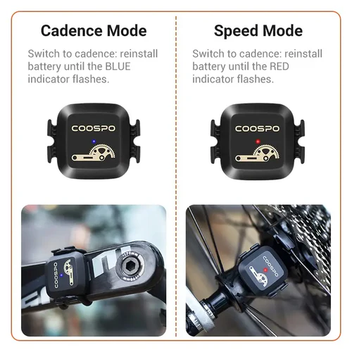

# BK6LS-Cadence — custom firmware for the COOSPO BK6LS cadence/speed sensor

**English** | [Русский](README.ru.md)



Custom, fully open firmware for the **COOSPO BK6LS** (BK6LS-0026006) BLE
cadence/speed sensor, built around the **nRF52810** SoC. The stock firmware was
reverse-engineered (pinout, accelerometer, LEDs — see [HARDWARE.md](HARDWARE.md))
and replaced with a Zephyr application that keeps compatibility with regular
cycling apps **and** adds a live, signed RPM stream for e-bike controllers.

> The picture above shows the stock battery-reinstall mode switch (cadence =
> blue, speed = red). This firmware currently runs in **crank (cadence) mode**;
> the wheel-mode plane switch is on the roadmap.

## Features

- **Standard BLE Cycling Speed & Cadence profile (`0x1816`)** — works out of the
  box with Wahoo/Garmin/any cycling app.
- **Custom RPM service** — signed `int16` centi-RPM notified every **100 ms**,
  sign = rotation direction (forward/backward). UUID
  `cad00001-eb1c-4f1e-9b2a-6f1c0de0cade`. Full client guide:
  [BLE_INTERFACE.md](BLE_INTERFACE.md).
- **Battery Service (`0x180F`)** — percent from coin-cell voltage via the
  internal SAADC (no external pins).
- **No magnets needed** — cadence is computed from the **rotating gravity
  vector** of the on-board 3-axis accelerometer (θ = atan2 of the in-plane axes;
  one full turn = one revolution, RPM = dθ/dt).
- **Adaptive power** — ACTIVE: 100 Hz sampling + advertising; after 20 s without
  motion and without a connection it stops advertising and drops to a 5 s
  low-power poll; any accelerometer change wakes it back up.
- **LED signals** — blue 1 s = wake/power-on, red 1 s = going to sleep
  (single bicolor LED, active-low).

## SDK / toolchain

| Component | Version |
|---|---|
| **nRF Connect SDK (NCS)** | **v3.2.4** |
| RTOS | Zephyr (bundled with NCS) |
| BLE controller | Nordic SoftDevice Controller, peripheral-only (`CONFIG_BT_LL_SOFTDEVICE`) |
| Board target | `nrf52dk/nrf52810` + [`app.overlay`](app.overlay) |
| Flash tool | `nrfjprog` + J-Link (SWD) |

The chip is the constrained nRF52810 (24 KB RAM / 192 KB flash), so
[`prj.conf`](prj.conf) trims BLE buffers and features to fit.

## Building

Builds are done in the NCS v3.2.4 toolchain environment (Windows; see
[`scripts/ncs-env.ps1`](scripts/ncs-env.ps1)):

```powershell
. .\scripts\ncs-env.ps1
west build -b nrf52dk/nrf52810 .
```

## Flashing

```powershell
nrfjprog --family NRF52 --program release\bk6ls-cadence-<version>.hex --chiperase --verify --reset
```

The original factory firmware is preserved in
[`stock-backup/stock_full.hex`](stock-backup/stock_full.hex) and can be restored
the same way at any time.

## Release

Prebuilt firmware images live in [`release/`](release/). To produce one:

```powershell
.\scripts\make-release.ps1              # builds and copies the hex into release/
.\scripts\make-release.ps1 -Version 1.0.0
.\scripts\make-release.ps1 -NoBuild     # package an existing build/ output
```

The script does a pristine `west build`, copies the hex to
`release/bk6ls-cadence-<version>.hex` and writes a `.txt` next to it with the
commit, date and SHA-256.

## Repository layout

```
src/            firmware: main loop, cadence math, accel driver, CSC/RPM/battery GATT
tools/pinscan/  bring-up firmware used to reverse the pinout / fingerprint the accel
tools/idle/     do-nothing firmware for driving pins from the debugger
scripts/        NCS environment + release script
stock-backup/   full factory firmware dump (restorable)
release/        prebuilt release hex files
HARDWARE.md     reverse-engineering notes (pinout, accel registers, LEDs)
BLE_INTERFACE.md client integration guide (self-contained)
```

## Status / roadmap

- [x] CSC + custom signed RPM + battery, adaptive sleep/wake
- [ ] Crank/wheel plane switch (stock "battery reinstall" mode change)
- [ ] Hardware wake-on-motion via the accel INT pin (P0.15/P0.25) + System OFF

## Disclaimer

This project is the result of reverse engineering a retail device. Flashing
custom firmware voids the warranty and can brick the sensor. Use at your own
risk. Not affiliated with COOSPO.
